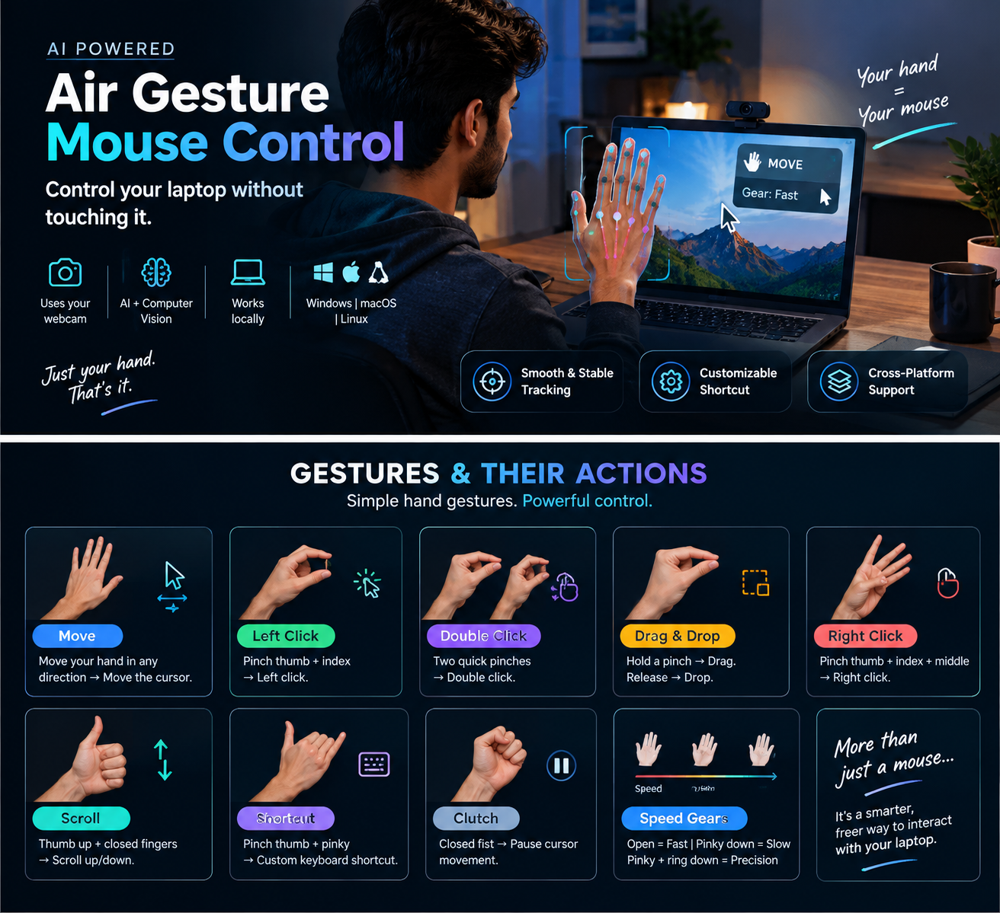

<div align="center">


</div>

---

## 🚀 Want a Windows `.exe`?

<div align="center">

## 📥 [**Check GitHub Releases for `main.exe`**](../../releases)

</div>

> Prefer the **Quick Start (Run from Source)** below — that path is always current.
> A Windows one-file binary can be built locally with PyInstaller via `main.spec` (`pyinstaller main.spec`). Publish the result on **Releases**; do **not** commit `build/`, `dist/`, or `.exe` files into git.

---

## 🎯 Overview

**Air Gesture Mouse Control** lets you control your laptop **without touching it**. Built for the moments you're sitting a bit far from the screen — leaning back, presenting, watching something — and don't want to reach for the trackpad just to move the cursor or click. One hand in front of the webcam becomes the mouse.

---

## IT'SS CRAZYYY 

<div align="center">




</div>

---


---

## 🛠️ Stack

| Piece | Why |
|---|---|
| **Python 3.10+** | Core runtime |
| **OpenCV** | Webcam capture, preview window, HUD |
| **MediaPipe Hand Landmarker** (Tasks API) | On-device 21-point hand tracking |
| **PyAutoGUI** | Cross-platform mouse moves, clicks, drags, scroll, hotkeys |
| **NumPy** | Landmark math |

- Everything runs **locally** — no cloud, no video ever leaves the machine.
- Cross-platform (Windows is the primary target; Linux and macOS work too).
- The model file (~8 MB) auto-downloads on first run.

---

## ⚡ Quick Start (Run from Source)

```bash
py -m venv venv
venv\Scripts\python -m pip install -r requirements.txt
```

**Windows:** double-click **`run.bat`** (uses the venv, no activation needed).
**Others:** `venv/bin/python main.py`

- **Q / Esc** quits. **Emergency stop:** fling the cursor into the top-left corner.
- Preview is mirrored, so moving your hand left moves the cursor left.

---

## 🖐️ Gestures

| Gesture | How | Action |
|---|---|---|
| **Move** | Move your open hand in any direction | Cursor moves with your hand's motion (relative, like a real mouse) — its position in the camera frame never matters |
| **Speed gear** | Open hand / pinky down / pinky+ring down | Fast / slow / precision cursor speed (see below) |
| **Clutch** | Closed fist, thumb tucked | Cursor released: no motion, no clicks; reopen anywhere, no jump |
| **Left click** | Pinch thumb+index, aim (cursor keeps following), **release** | Left click where you aimed |
| **Double click** | Two quick thumb+index pinches | Double-click |
| **Drag** | Pinch thumb+index, hold ~0.9s, move, release | Click-and-drag (deliberate hold — a slow click never drags) |
| **Right click** | Pinch **thumb+index+middle** (or thumb+middle), release | Right click |
| **Shortcut** | Pinch **thumb+pinky**, release | Fires a customizable combo (default **Ctrl+Win+Space**), repeatable |
| **Scroll** | **Thumb up, all four fingers closed**, move hand up/down | Scroll up/down, speed-proportional (thumb out = scroll, thumb tucked = clutch) |

### 🎚️ Cursor Speed Gears

| Hand | Speed |
|---|---|
| Open hand | Fast — cross the screen |
| Pinky down | Slow |
| Pinky + ring down | Precision (extremely slow, for careful aiming) |

Gears apply to cursor motion only: **dragging always runs at full speed** and **scrolling ignores gears**. Pinching to click automatically aims in a slow gear.

---

## ✨ Features

<table>
<tr>
<td width="50%" valign="top">

- **Relative motion control** — reach any screen edge with the hand comfortably in frame; a closed fist is the clutch.
- **Release-to-click** — the cursor keeps following while you pinch (aiming), the release performs the click, so clicks land on a still target.
- **Stable by design** — palm-anchored tracking (pinching never shakes the cursor), velocity-adaptive smoothing, tremor-canceling deadzone.

</td>
<td width="50%" valign="top">

- **Customizable shortcut** — edit `SHORTCUT_KEYS` in `config.py` to any PyAutoGUI key combo.
- **On-screen HUD** — live status (`LEFT CLICK`, `DRAGGING`, `SCROLL`, ...), finger states, pinch ratios, current gear, and a gesture legend.
- **Offline test suite** — `venv\Scripts\python tests\test_logic.py` verifies the whole gesture-to-mouse state machine without a camera.

</td>
</tr>
</table>

---

## 📦 Install Details

### 🪟 Windows
Usually works out of the box in the venv. Allow camera access if prompted.

### 🐧 Linux
```bash
sudo apt install python3-tk python3-dev python3-xlib
```
X11 works directly; on Wayland mouse control may be restricted (try XWayland).

### 🍎 macOS
Grant **Camera** and **Accessibility** (mouse control) to your terminal/Python in
System Settings → Privacy & Security, then restart the terminal.

---

## 🏗️ Project Layout

```
Air-Gesture-Mouse-Control/
├── main.py                 # Camera loop, HUD, action state machine
├── gestures.py             # Palm anchor, finger/pinch/fist/scroll-pose/gear detection
├── mouse_controller.py     # Mouse actions + smoothing (incl. Windows wheel-notch fix)
├── config.py               # Tunables (gains, gears, pinch feel, timings, shortcut keys)
├── hand.py                 # Thin wrapper -> main.main()
├── tests/test_logic.py     # Offline gesture state-machine tests
├── run.bat                 # Windows launcher (uses project venv)
├── requirements.txt
├── main.spec               # Optional PyInstaller recipe for Windows .exe
├── air_gesture_preview.png # Preview image
├── prompt.md               # Living brief for agents working on this repo
└── README.md               # You're here
```

Not committed: `venv/`, `hand_landmarker.task` (auto-downloaded), `build/`, `dist/`.

---

## 🧩 Troubleshooting

| Problem | Fix |
|---|---|
| `ModuleNotFoundError` | You are on the system Python. Use `run.bat` or `venv\Scripts\python main.py`. |
| Camera won't open | Change `CAMERA_INDEX` (try `1`); close other apps using the webcam. |
| Cursor too slow / fast | Tune `RELATIVE_GAIN_X` / `RELATIVE_GAIN_Y`. |
| Cursor jittery / laggy | Raise `ANCHOR_ALPHA_SLOW` / lower `SMOOTHING` (and vice versa). |
| Clicks too sensitive / miss | Adjust `PINCH_ON_RATIO` / `PINCH_OFF_RATIO`. |
| Scroll too slow / fast | Lower / raise `SCROLL_TICK_TRAVEL` (one notch ~ 3 lines on Windows). |
| Drag triggers by accident | Raise `DRAG_HOLD_TIME`. |
| Scroll triggers by accident | Raise `SCROLL_CONFIRM_FRAMES`. |
| Script dies suddenly | You hit the FAILSAFE (cursor in the top-left corner). Re-run. |

---

## ⚠️ Limitations

- One hand, front camera. Mild angles are fine; extreme side views struggle.
- Poor lighting or busy backgrounds reduce tracking quality.
- Deliberately a small set of reliable gestures instead of many fragile ones.

---

<div align="center">

### ⭐ Star this repo if Air Gesture Mouse Control impressed you!


</div>
